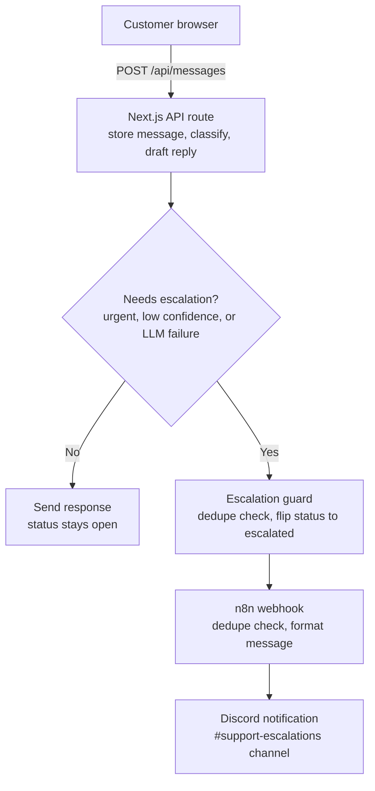

# Customer Support AI Assistant

A small customer support system: a customer sends a message, an LLM classifies it and drafts
a response grounded in a small knowledge base, and conversations the AI can't (or shouldn't)
handle alone get escalated to a human via an n8n automation.

## Stack

**Frontend:** Next.js 14 (App Router), plain React, no UI framework
**Database:** Supabase (Postgres)
**LLM:** [Groq](https://groq.com) (`llama-3.3-70b-versatile` by default) via structured JSON output — free, no billing required, using an OpenAI-compatible API so the code can point at OpenAI [...]
**Automation:** n8n (self-hosted, free) — Webhook → dedupe check → Discord notification

## Architecture



### Why these decisions

**One LLM call, not two.** Classification and response generation share context (the
knowledge base, the message), so a single structured call is simpler and cheaper than
chaining two calls. The trade-off is a slightly more complex prompt/schema — worth it at
this scale.
**No vector DB / RAG.** The knowledge base is 7 hardcoded FAQ entries (`lib/knowledgeBase.js`)
injected directly into the prompt. A real product might use embeddings + retrieval, but for
a demo sized KB that would be over engineering, which the brief explicitly asked to avoid.
**Escalation is a status, not a guess.** `conversations.status` is the single source of
truth (`open | escalated | resolved`). The AI never "pretends" to resolve something it
flagged as needing a human — the UI shows an explicit banner once escalated.
**Fail closed, not open.** Any LLM failure (API error, malformed JSON, schema mismatch) is
treated as an automatic escalation with a generic "we're looping in a human" response,
rather than risking a wrong answer reaching the customer. See `lib/llm.js::fallbackResult`.
**Duplicate escalation guard, two layers.** (1) Application logic checks
`conversation.status` before writing a new escalation row. (2) A Postgres partial unique
index (`escalations(conversation_id) WHERE notified = false`) prevents a race condition
from creating two active escalations for the same conversation, even under concurrent
requests. (3) n8n itself also does a lightweight time window dedupe as a third layer, in
case the webhook gets called twice from outside this app.

## Setup

### 1. Supabase

1. Create a project at [supabase.com](https://supabase.com).
2. Open the SQL editor and run `supabase/schema.sql`.
3. Copy your Project URL, `anon` key, and `service_role` key into `.env.local` (see below).

### 2. Environment variables

```bash
cp .env.example .env.local
```

Fill in:

`NEXT_PUBLIC_SUPABASE_URL`, `NEXT_PUBLIC_SUPABASE_ANON_KEY`, `SUPABASE_SERVICE_ROLE_KEY`
`GROQ_API_KEY` — free key from [console.groq.com/keys](https://console.groq.com/keys), no card required
`N8N_ESCALATION_WEBHOOK_URL` (from step 3)

> **Why Groq instead of OpenAI?** The challenge allows "OpenAI, Claude, or another suitable
> LLM." Groq's API is free and OpenAI-compatible (same `openai` npm SDK, just a different
> `baseURL`), so it made sense to avoid a billing requirement for a demo project. Swapping
> back to OpenAI is a one-line env change — see the comments in `.env.example`.

### 3. n8n

Run n8n locally for free (no n8n.cloud billing needed):

```bash
npx n8n
```

This opens n8n at `http://localhost:5678` on first run (create a local owner account when prompted — stays on your machine, no cost).

1. Import `n8n/escalation-workflow.json` into your n8n instance (Workflows → Import from File).
2. Create a free Discord webhook: in Discord, go to a server you own → Server Settings →
   Integrations → Webhooks → New Webhook → Copy Webhook URL. Paste that URL into the
   "Discord - Notify Support Channel" node's URL field (replacing the placeholder), or set it
   dynamically via the `discordWebhookUrl` field in the trigger payload.
3. In the Webhook - Escalation Trigger node, set Response Mode to "Using 'Respond to Webhook'
   Node" (not "Immediately") — otherwise the workflow's Respond nodes are unreachable and it
   errors on execution.
4. Activate/publish the workflow and copy its Production Webhook URL (from the
   "Webhook - Escalation Trigger" node) into `N8N_ESCALATION_WEBHOOK_URL`.

> **Why Discord instead of Slack?** Both are free, but Slack requires creating an app and
> setting up OAuth credentials in n8n, which is extra setup for no real benefit in a demo.
> A Discord webhook URL is copy paste, no auth flow. Swapping back to Slack (or email) just
> means changing this one node — the rest of the workflow (dedupe, guards, responses) is
> unaffected.

The webhook receives:
```json
{
  "conversation_id": "uuid",
  "customer_message": "string",
  "classification": "urgent",
  "reason": "string",
  "escalated_at": "ISO timestamp"
}
```

### 4. Run the app

```bash
npm install
npm run dev
```

Open `http://localhost:3000`.

## Assumptions

No auth system — a customer just enters an email to start a conversation. A real product
would tie this to Supabase Auth or an existing account system.
One active conversation per customer session (no conversation list/history UI). Multi thread
support was out of scope for the estimated time.
Escalation is one way in this demo — there's no agent side UI to reply and resolve a
conversation. The `messages.sender = 'agent'` and `conversations.status = 'resolved'` states
are modeled in the schema and rendered in the UI (green bubble) but nothing currently writes
to them; a real system would add an agent dashboard that does.
The `anon` key has open read/write on `users`/`conversations`/`messages` for demo simplicity.
`escalations` is service role only. A production app would scope these with real RLS
policies tied to authenticated user IDs.
The n8n dedupe window (5 minutes) is a reasonable default, not a requirement from the brief —
documented here rather than treated as a hidden magic number.
Swapped OpenAI → Groq and Slack → Discord from the most "default" choices, purely to avoid
billing/OAuth setup for a demo scale project; both are documented substitutions the brief
explicitly allows ("OpenAI, Claude, or another suitable LLM").

## What I would improve if I had another week

Add an agent facing view (list of escalated conversations, ability to reply and mark
resolved) so the handoff loop actually closes.
Retry/reconcile escalations whose n8n webhook call failed — right now it's logged but not
retried; a small cron/cleanup job that re sends any `escalations` row where
`notified = false` after N minutes would close that gap.
Real auth (Supabase Auth) instead of email as identifier.
Streaming AI responses instead of waiting for the full completion.
Tighten RLS policies now scoped to `true` for demo speed.
Rate limit `/api/messages` per user/IP to prevent abuse of the LLM call.
Unit tests for `lib/llm.js`'s validation/fallback branches, and an integration test for the
escalation dedupe path specifically (concurrent requests hitting the unique index).

## Reflection Questions

### 1. A technical problem I got stuck on

While testing the escalation flow, I sent an urgent test message ("its an emergency, my acc is hacked") and confirmed the AI correctly classified it and flipped the conversation to "escalated" ��[...]

My first guess was that the Discord webhook URL itself was wrong, so I went back into Discord, regenerated the webhook, and re pasted the URL into the n8n node. That didn't fix it.

To actually investigate, I opened the workflow in n8n and checked the **Executions** tab, which showed the failed run in red. Clicking into it surfaced the real error: *"Unused Respond to Webhook[...]

Looking at the Webhook - Escalation Trigger node, its Response Mode was set to "Immediately" — meaning it sends a response back the instant the request is received, instead of waiting for one o[...]

The fix was changing the Response Mode to "Using 'Respond to Webhook' Node," saving, and re publishing the workflow. After that, re sending the same urgent test message went through cleanly (`POS[...]

### 2. What I worked on, start to finish

I started by scaffolding the Next.js project structure and the Supabase schema — tables for `users`, `conversations`, `messages`, and `escalations`, including a partial unique index on `escalat[...]

Next I wired up the LLM classification logic — a single structured call that returns classification, confidence, a grounded response, and an escalation decision, validated against a strict sche[...]

I built the chat UI next — an email gate, a message thread with customer/AI bubbles, a status pill that reflects the conversation state, and an escalation banner. Then I connected it all throug[...]

For automation, I imported the n8n workflow (Webhook → dedupe check → notification), and similarly swapped the notification step from Slack to a Discord webhook to avoid an unnecessary OAuth [...]

Testing was the last phase and where most of the real debugging happened: I confirmed the happy path (normal question → grounded answer → stays "open"), the escalation path (urgent message ��[...]

I used Claude throughout as a pair programming/debugging partner — it helped scaffold the initial file structure and boilerplate, and walked me through debugging the n8n error step by step (che[...]

### 3. If this chatbot suddenly started giving wrong answers in production

I'd investigate in this order:

1. **Scope it** — is this every conversation, one classification category, or one user? Query
   recent `messages` rows grouped by `classification` and look for a spike in a particular
   category or a drop in average `confidence`.
2. **Check for a recent change** — did the system prompt, the knowledge base
   (`lib/knowledgeBase.js`), or the model (`LLM_MODEL`) change recently? LLM behavior is
   sensitive to prompt edits; I'd diff recent commits to `lib/llm.js` and `lib/knowledgeBase.js`
   first.
3. **Check for an upstream provider issue** — the LLM provider's status page, and whether error
   rates (`llm_failure_reason` column on `messages`) spiked, which would mean this is fallback
   behavior, not the model actually answering wrong.
4. **Reproduce it** — take an actual failing customer message from the `messages` table and
   replay it directly against the LLM call in isolation, outside the full app, to see the raw
   model output.
5. **Check the knowledge base for staleness** — if the model is confidently wrong, the most
   likely cause for a grounded response system like this is outdated or missing info in the
   knowledge base rather than the model "hallucinating" from nothing.
6. **Mitigate immediately, diagnose after** — if it's actively harming customers, I'd lower the
   confidence threshold (force more conversations to escalate) or disable AI responses
   entirely (route everything to `needs_escalation = true`) while root causing, since the
   escalation path already exists and is the safe fallback.
